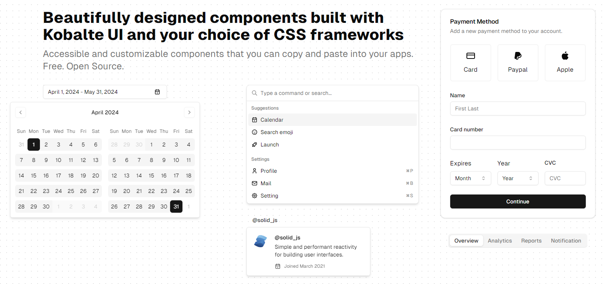

 
 <h1 align="center">
  shadcn-solid
 </h1>

[shadcn-solid](https://shadcn-solid.vercel.app/) is an unofficial community-led [SolidJS](https://www.solidjs.com/) port of [shadcn/ui](https://ui.shadcn.com/).

Accessible and customizable components that you can copy and paste into your apps. Free. Open Source. **Use this to build your own component library**.

## Documentation

Visit our [documentation](https://shadcn-solid.com/docs/introduction) to learn more.

## License

Licensed under the [MIT license](https://github.com/hngngn/shadcn-solid/blob/main/LICENSE.md).
